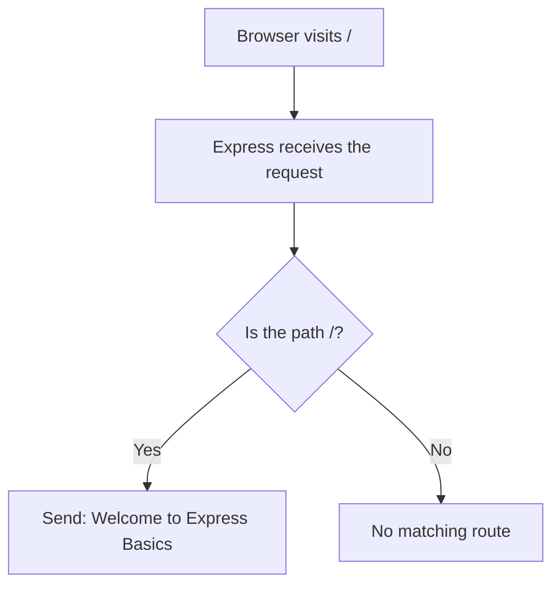

# Express Basics Diagram

This diagram shows the smallest possible Express flow.

## Reading the flow

1. The browser makes a request.
2. Express receives it.
3. The app checks the path with a simple route match.
4. If the path is `/`, the server sends the welcome message.
