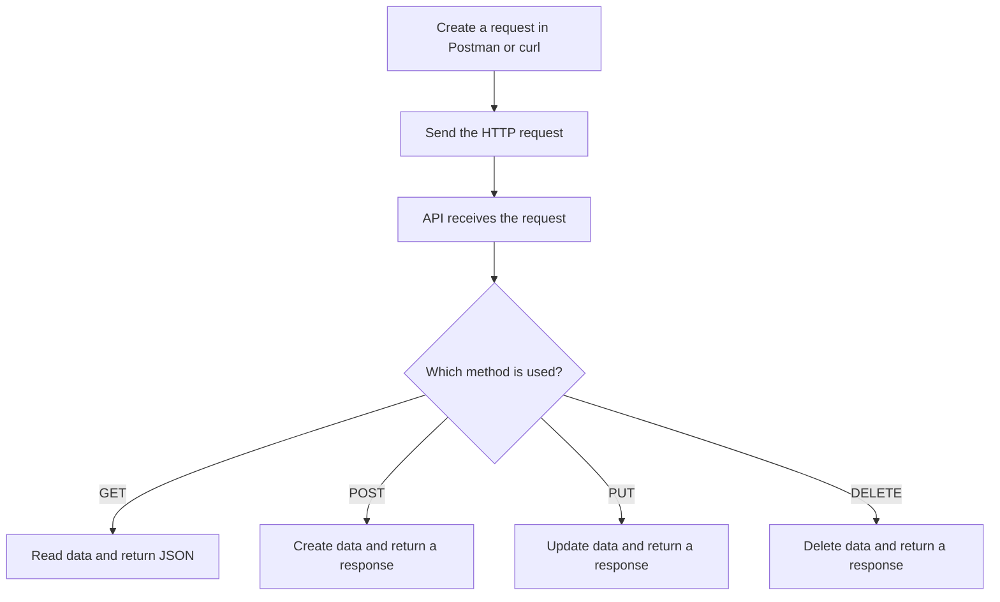

# REST API + Postman Diagram

This diagram shows the basic request flow for the REST API chapter.

## Reading the flow

1. You build a request in Postman or with `curl`.
2. The request is sent to the API.
3. The server checks the HTTP method.
4. The API sends back the matching response.
