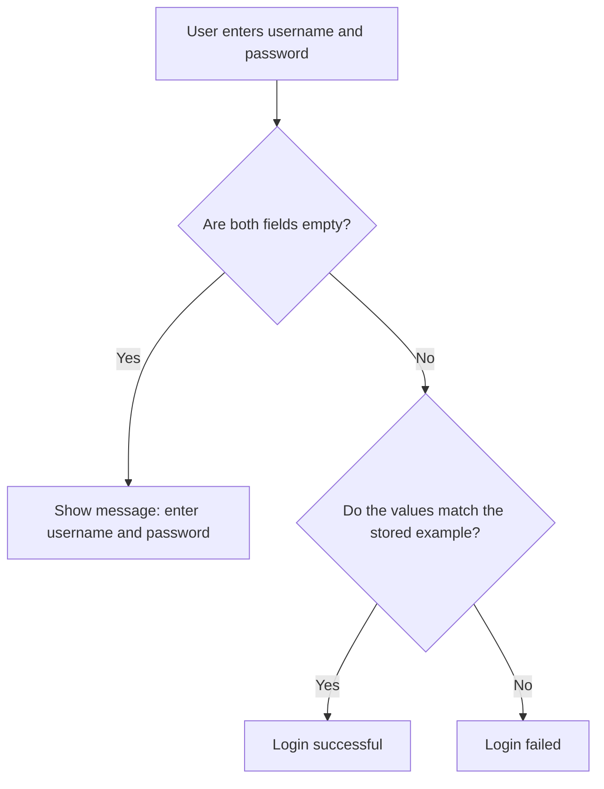

# Diagram

This module uses one simple flow to explain authentication.

## Reading the flow

1. Start with the login form.
2. Check whether the user typed anything.
3. Compare the values with the stored example.
4. Show either success or failure.