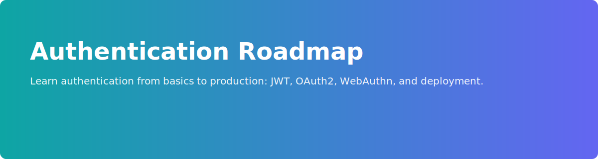

   

   [](LICENSE) [](https://github.com/AyushBhardwaj-AdRuntime/authentication-roadmap/stargazers) [](https://github.com/AyushBhardwaj-AdRuntime/authentication-roadmap/issues)

   # Authentication Roadmap

   > Learn authentication from basics to production: secure logins, JWTs, OAuth2, WebAuthn, and deployment.

   ## 📚 Table of Contents

   - [Quick start](#quick-start)
   - [What you'll learn](#what-youll-learn)
   - [Modules (roadmap)](#modules-roadmap)
   - [Prerequisites](#prerequisites)
   - [Repository structure](#repository-structure)
   - [Progress tracker](#progress-tracker)
   - [Contributing](#contributing)

---

## 📋 Prerequisites

* Basic understanding of JavaScript
* Node.js installed on your machine

Download Node.js:

https://nodejs.org/en/download/

---

## 🚀 Before Starting

Remember one thing:

**Don't worry if you don't understand every term immediately.**

You will gradually understand concepts such as:

* Express
* Middleware
* Authentication
* JWT
* Authorization
* Refresh Tokens

The goal is not to memorize.

The goal is to understand how authentication works in real-world applications.

---

## 🗺️ How This Roadmap Is Designed

* 20% Theory
* 30% Diagrams
* 40% Code
* 10% Practice

This roadmap follows a:

```text
Concept
   ↓
Diagram
   ↓
Code
   ↓
Practice
```

approach.

---

## 📖 How To Use This Roadmap

### 1. Read the Theory

📁 README.md

Understand the concept before writing code.

### 2. Study the Diagrams

📁 diagrams/

Visualize how everything works.

### 3. Explore the Code

📁 code/

See real implementations.

### 4. Complete the Practice Tasks

📁 practice/

Test your understanding.

---

## 📂 Repository Structure

```text
authentication-roadmap
│
├── express-basics
├── restapi-postman
├── authentication-fundamentals
├── authentication-api
├── input-validation
├── password-hashing
├── jwt-authentication
├── protected-routes
├── role-based-access-control
├── refresh-tokens
├── mongodb-authentication
├── postgresql-authentication
├── docker-deployment
│
└── README.md
```

---

## ⏱ Recommended Learning Flow

Each chapter is designed to take approximately:

* 5 minutes reading
* 2 minutes diagram analysis
* 5 minutes code walkthrough
* 5 minutes practice

Total:

**15-20 minutes per chapter**

---

## 📖 Topics Covered

### Foundations

* Express Basics
* REST API Basics
* Authentication Fundamentals

### Core Authentication

* Authentication API
* Input Validation
* Password Hashing
* JWT Authentication

### Authorization

* Protected Routes
* Role Based Access Control (RBAC)

### Advanced Authentication

* Refresh Tokens

### Database Integration

* MongoDB Authentication
* PostgreSQL Authentication

### Deployment

* Docker Deployment

---

## 📈 Progress Tracker

* [ ] Express Basics
* [ ] REST API Basics
* [ ] Authentication Fundamentals
* [ ] Authentication API
* [ ] Input Validation
* [ ] Password Hashing
* [ ] JWT Authentication
* [ ] Protected Routes
* [ ] RBAC
* [ ] Refresh Tokens
* [ ] MongoDB Authentication
* [ ] PostgreSQL Authentication
* [ ] Docker Deployment

---

## 🌟 Goal Of This Repository

Help beginners understand authentication from scratch and learn how authentication works in production-grade applications.

---


---

## Quick start

```bash
git clone https://github.com/AyushBhardwaj-AdRuntime/authentication-roadmap.git
cd authentication-roadmap
# open any module folder, for example: 2.restapi-postman
```

## What you'll learn

- Fundamentals of authentication and authorization
- Secure password hashing and storage
- JWTs, refresh tokens, and secure rotation
- OAuth2 and OpenID Connect basics
- WebAuthn and passwordless flows
- Database-backed authentication (MongoDB & PostgreSQL)
- Containerizing and deploying auth services with Docker

---

## Modules (roadmap)

- [2.restapi-postman](2.restapi-postman/README.md)
- [3.authentication-fundamentals](3.authentication-fundamentals/README.md)
- [4.authentication-api](4.authentication-api/README.md)
- [5.input-validation](5.input-validation/README.md)
- [6.password-hashing](6.password-hashing/README.md)
- [7.jwt-authentication](7.jwt-authentication/README.md)
- [8.protected-routes](8.protected-routes/README.md)
- [9.role-based-access-control](9.role-based-access-control/README.md)
- [10.refresh-tokens](10.refresh-tokens/README.md)
- [11.mongodb-authentication](11.mongodb-authentication/README.md)
- [12.postgresql-authentication](12.postgresql-authentication/README.md)
- [13.docker-deployment](13.docker-deployment/README.md)

---

<a id="prerequisites"></a>
## 📋 Prerequisites

- Basic JavaScript knowledge
- Node.js installed

https://nodejs.org/en/download/

---

<a id="repository-structure"></a>
## 📂 Repository structure

```text
authentication-roadmap
│
├── 1.express-basics
├── 2.restapi-postman
├── 3.authentication-fundamentals
├── 4.authentication-api
├── 5.input-validation
├── 6.password-hashing
├── 7.jwt-authentication
├── 8.protected-routes
├── 9.role-based-access-control
├── 10.refresh-tokens
├── 11.mongodb-authentication
├── 12.postgresql-authentication
├── 13.docker-deployment
│
└── README
```

---

## ⏱ Recommended learning flow

Each chapter: 15–20 minutes (read → diagram → code → practice).

---

<a id="progress-tracker"></a>
## 📈 Progress tracker

- [ ] Express Basics
- [ ] REST API Basics
- [ ] Authentication Fundamentals
- [ ] Authentication API
- [ ] Input Validation
- [ ] Password Hashing
- [ ] JWT Authentication
- [ ] Protected Routes
- [ ] RBAC
- [ ] Refresh Tokens
- [ ] MongoDB Authentication
- [ ] PostgreSQL Authentication
- [ ] Docker Deployment

---

<a id="contributing"></a>
## Contributing

Contributions welcome — please read `CONTRIBUTING.md` and pick an issue.

---

## License

This project will use the MIT license. See `LICENSE` for details.

---

> Tip: Add a screenshot or short GIF under the banner demonstrating a login flow to boost conversions.
